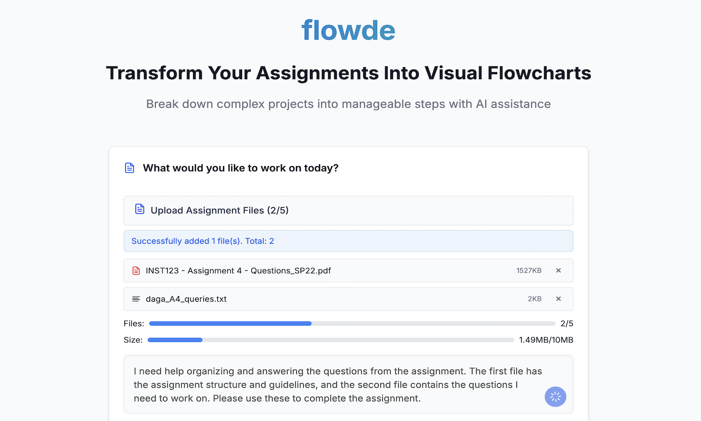

# Flowde

[](https://getflowde.com)
[](LICENSE)

Flowde is an AI-powered assignment workflow assistant that helps students break down complex assignments into visual, actionable steps. Whether you're working on a research thesis, coding project, or group report, Flowde offers a structured way to understand, plan, and complete your work more efficiently.

## 🌐 Live Website
👉 Visit [getflowde.com](https://getflowde.com) to try it out!

---

## ✨ Features

- **AI Workflow Generator**: Converts assignment prompts into structured flowcharts with steps and sub-steps.
- **Visual Flow Editor**: Edit, rearrange, and customize your workflow using an intuitive drag-and-drop interface.
- **Deep Dive Chat**: Ask questions about each workflow step and get AI-generated guidance using your uploaded materials.
- **Document Uploads**: Upload PDFs and additional resources to improve context awareness.
- **UMD Course RAG Support**: Integrated Retrieval-Augmented Generation from notes for CMSC131, CMSC132, and other introductory CS courses.
- **User Authentication**: Google OAuth login support.
- **Responsive UI**: Built with modern UI design and supports both desktop and mobile.

---

## 🛠️ Tech Stack

- **Frontend**: React, Vite, Tailwind CSS, React Flow, Axios
- **Backend**: FastAPI, PostgreSQL (via Supabase), SQLAlchemy
- **AI Integration**: OpenAI API with Retrieval-Augmented Generation (RAG)
- **Deployment**: 
  - Frontend on Vercel
  - Backend on Render
  - Domain via Namecheap (https://getflowde.com)

---

## 🖼️ Screenshots
Explore how Flowde helps students break down assignments into clear, structured workflows:

📝 Assignment Upload
Upload any assignment file or paste instructions to get started.


📊 Flowchart Generation
Automatically generates a visual step-by-step breakdown of your assignment with editable nodes.


💬 Deep Dive Chat
Dive deeper into any task for clarification, help, or guidance using our AI-powered assistant.


🏠 Dashboard View (Hero Section)
An overview of your current assignments and progress all in one place.


---

## 🚀 Getting Started

### 1. Clone the repository
```bash
git clone https://github.com/aryandaga7/assignment-workflow.git
cd assignment-workflow
```

### 2. Setup Frontend
```bash
cd frontend
npm install
npm run dev
```

### 3. Setup Backend
```bash
cd backend
pip install -r requirements.txt
uvicorn main:app --reload
```

> Ensure your `.env` file is properly configured for Supabase and OpenAI API credentials.

---

## ⚙️ Environment Variables

For the backend `.env` file:
```
OPENAI_API_KEY=your-api-key
SUPABASE_URL=your-supabase-url
SUPABASE_KEY=your-service-role-key
DATABASE_URL=your-database-url (use pooling endpoint)
```

---

## 🤝 Acknowledgments

- Built by [Aryan Daga](https://github.com/aryandaga7)
- Inspired by the need for structured academic support tools powered by modern AI.

---

## 📄 License

This project is licensed under the MIT License - see the [LICENSE](LICENSE) file for details.

---

© 2025 Flowde. All rights reserved.
